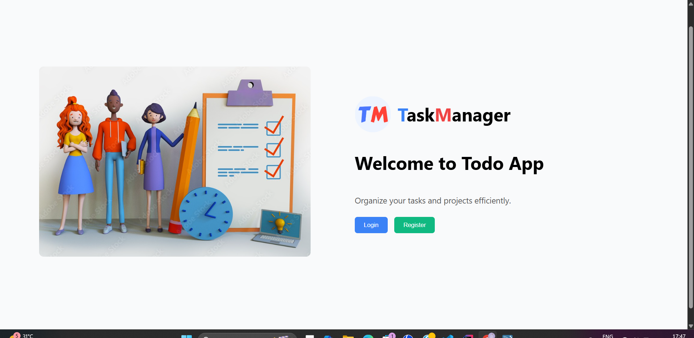
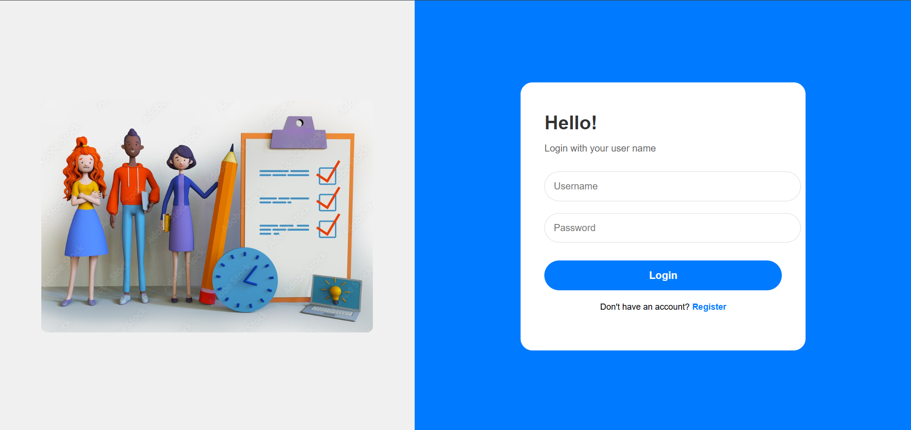
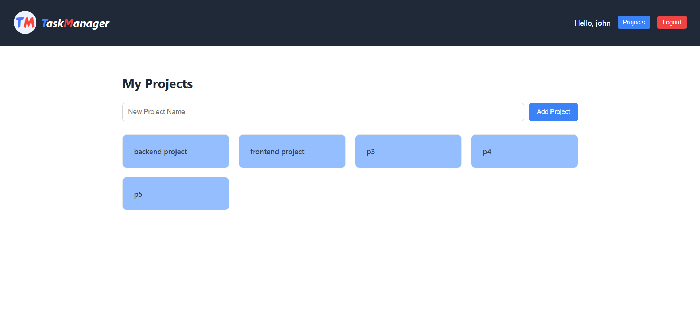
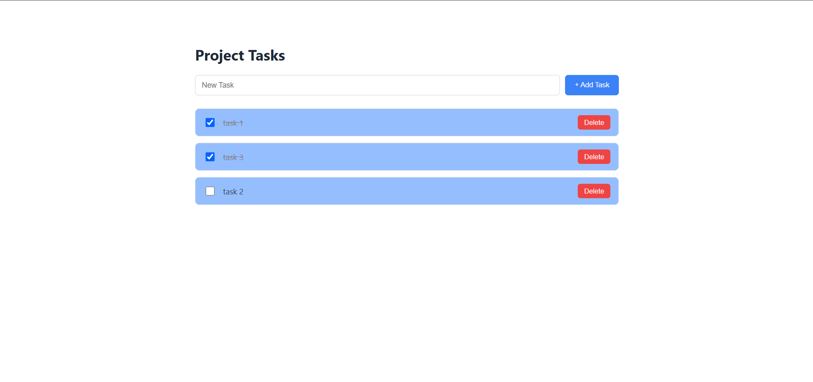

# Project Management System

A **Full Stack Todo Application** where users can create accounts, manage projects, and organize tasks inside projects.

Each user has secure, personal projects and tasks, making it useful for **productivity and task tracking**.

---

# Features

## Authentication
- User Registration
- User Login
- Password encryption using **BCrypt**
- Protected routes

## Project Management
- Create Projects
- View Projects for logged-in user

## Task Management
- Create Tasks inside a Project
- Mark Tasks as Completed
- Delete Tasks
- Toggle Task Completion

---

# Tech Stack

## Frontend
- React
- React Router
- Axios
- CSS

## Backend
- Spring Boot
- Spring Data JPA
- REST APIs

## Database
- MySQL

---

# System Architecture

```
React Frontend
      │
      │  REST API (Axios)
      ▼
Spring Boot Backend
      │
      │  JPA / Hibernate
      ▼
MySQL Database
```

---

# Project Structure

## Backend

```
backend
│
├── controller
│   ├── AuthController
│   ├── ProjectController
│   ├── TaskController
│
├── service
│   ├── AuthService
│   ├── ProjectService
│   ├── TaskService
│   ├── AuthServiceImpl
│   ├── ProjectServiceImpl
│   ├── TaskServiceImpl
│
├── repository
│   ├── UserRepository
│   ├── ProjectRepository
│   ├── TaskRepository
│
├── model
│   ├── User
│   ├── Project
│   ├── Task
│
├── dto
│   ├── LoginRequest
│   ├── RegisterRequest
│
├── exception
│   ├── ResourceNotFoundException
|   ├── GlobalExceptionHandler
```


## Frontend

```
frontend
│
├── src
│
├── components
│   ├── Navbar.js
│
├── images
│   ├──logo.png
│   ├──todo.jpg
│
├── pages
│   ├── LandingPage.js
│   ├── LoginPage.js
│   ├── RegisterPage.js
│   ├── ProjectsPage.js
│   ├── TasksPage.js
│
├── routes
│   ├──protectedRoute.js
│
├── services
│   ├── api.js
│   ├── authService.js
│   ├── projectService.js
│   ├── taskService.js
│
├── styles
│   ├── Landing.css
│   ├── LoginPage.css
│   ├── Navbar.css
│   ├── ProjectsPage.css
│   ├── RegisterPage.css
│   ├── TasksPage.css
│
├── App.js
└── index.js
```

---

# Database Setup

Create the database:

```sql
CREATE DATABASE todo_db;
```

Update `application.properties`

```
spring.datasource.url=jdbc:mysql://localhost:3306/todo_db
spring.datasource.username=root
spring.datasource.password=yourpassword

spring.jpa.hibernate.ddl-auto=update
spring.jpa.show-sql=true
```

---

# Backend Setup

### 1 Clone Repository

```bash
git clone https://github.com/your-username/project-management-app.git
```

### 2 Navigate to Backend

```bash
cd backend
```

### 3 Run Application

```bash
mvn spring-boot:run
```

Backend runs at:

```
http://localhost:9092
```

---

# Frontend Setup

### 1 Navigate to Frontend

```bash
cd frontend
```

### 2 Install Dependencies

```bash
npm install
```

### 3 Run React Application

```bash
npm start
```

Frontend runs at:

```
http://localhost:3000
```

---

# API Endpoints

## Authentication

| Method | Endpoint | Description |
|------|------|------|
| POST | `/auth/register` | Register a new user |
| POST | `/auth/login` | Login user |

## Projects

| Method | Endpoint | Description |
|------|------|------|
| POST | `/projects/{userId}` | Create project |
| GET | `/projects/{userId}` | Get all projects |

## Tasks

| Method | Endpoint | Description |
|------|------|------|
| POST | `/projects/{projectId}/tasks` | Create task |
| GET | `/projects/{projectId}/tasks` | Get tasks |
| DELETE | `/projects/{projectId}/tasks/{taskId}` | Delete task |
| PUT | `/projects/{projectId}/tasks/{taskId}/toggle` | Toggle task completion |

---

## API Documentation - Swagger UI

This project uses **Springdoc OpenAPI** to generate Swagger UI for API documentation.

### Accessing Swagger UI

1. Make sure the backend server is running:

```bash
cd backend
mvn spring-boot:run
```

2. Open your browser and go to:
http://localhost:9092/swagger-ui/index.html

3. You will see a visual interface of all the available APIs:

Authentication APIs (/auth/**)

Project APIs (/projects/**)

Task APIs (/projects/{projectId}/tasks/**)

4. You can try out the APIs directly from Swagger UI:

Click on any endpoint

Fill in the required fields

Press "Execute" to see live responses from the backend

# Application Flow

1. User registers an account.
2. User logs into the application.
3. User creates projects.
4. Inside each project, tasks can be added.
5. Tasks can be completed or deleted.

---

# Screenshots

## Landing Page


## Login Page


## Register Page


## Projects Page


## Tasks Page


# Future Improvements

- JWT Authentication
- Project progress tracking
- Task deadlines
- Notifications
- Docker deployment
- Cloud hosting (AWS / Render)

---

# Author

**Shajitha S**

Computer Science Student  
